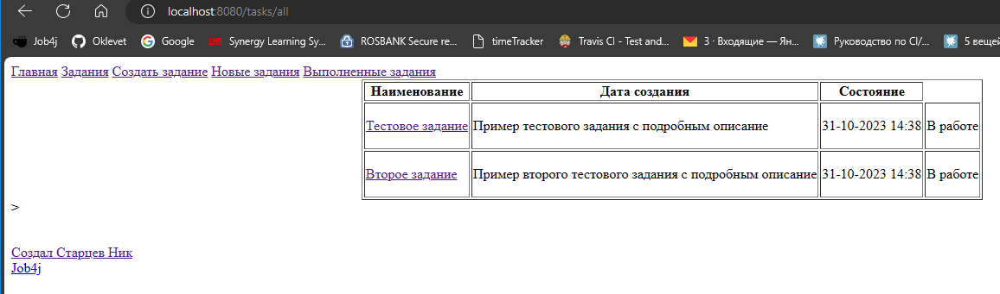
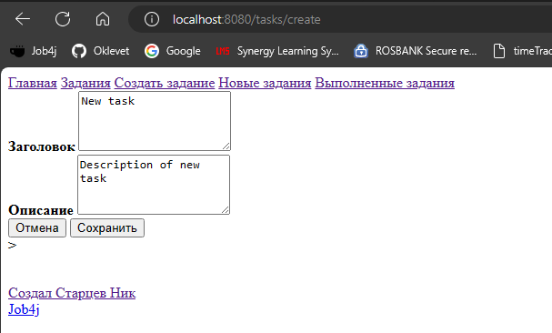
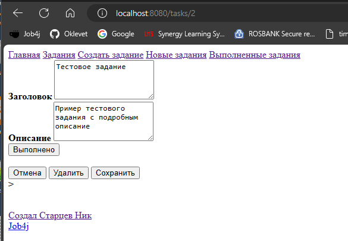

job4j_todo

Проект по созданию упрощённого todo-list, с водзможностью добавлять/редактировать/удалять задачи, 
а также переводить их в статус выполнено и обратно. Можно отделать выполненные и невыполненные задачи путём фильтрации.

База данных пока реализована одной таблицей:
tasks - все задачи;

Требования к окружению:
Java 17.0.2,
PostgreSQL 14.0,
Apache Maven 3.8.4

Используемые технологии:
Java 17
Maven 3.9
PostgreSQL 16
Spring Boot
Hibernate 5
Liquibase 4
Thymeleaf
Bootstrap
Checkstyle
IntelliJ IDEA 2022.2.3

1. Для запуска проекта, необходимо клонировать проект из этого репозитория;
2. Затем необходимо создать локальную базу данных "todo";
3. Прописать логин и пароль к созданной базе данных в файл db/liquibase.properties;
4. Далее запустите liquibase для предварительного создания таблиц;
5. Запустите приложение одним из представленных ниже способов:
   5.1 Через класс Main, находящийся в папке src\main\java\ru\job4j\todo;
   5.2 Скомпилировав и запустив проект через maven командой mvn spring-boot:run;
   5.3 Собрав проект через maven и запустив собранный файл командой java -jar job4j_todo-1.0-SNAPSHOT.jar;
6. Открыть в браузере страницу http://localhost:8080/index;

Главная страница и список всех задач:

Создание задачи:

Редактирование задачи:
